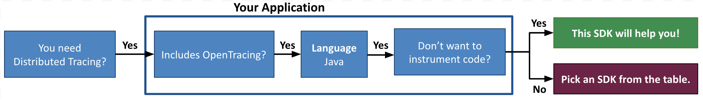

# wavefront-opentracing-bundle-java

## Table of Content
* [Prerequisites](#Prerequisites)
* [Setup Steps](#Setup-Steps)
* [Parameters](#Parameters)
* [Instrumenting a Java Based Container](#Instrumenting-a-Java-Based-Container)

# Welcome to the Wavefront Java Tracing Agent
The Wavefront Java Tracing Agent provides application observability without having to do any code changes.

<p align="left">
  
</p> 

The Wavefront Java Tracing Agent includes:
* The [Java OpenTracing SpecialAgent](https://github.com/opentracing-contrib/java-specialagent), which automatically instruments Java applications with traces.
* The Wavefront OpenTracing Bundle that is implemented in this repository, which sends the tracing data to Wavefront for observability.

**Before you start implementing, let us make sure you are using the correct SDK!**



> <b><i>Note</i></b>:
> </br>
>   * **This is the Wavefront by VMware Java Tracing Agent!**
>   If this is not what you were looking for, see the [table](#wavefront-sdks) given below.
>   * Want to write code to instrument your application? Use the [Wavefront Java OpenTracing SDK](https://github.com/wavefrontHQ/wavefront-opentracing-sdk-java).
>   * See <a href="https://docs.wavefront.com/tracing_instrumenting_frameworks.html">instrument your application for tracing</a> for more information.

#### Wavefront SDKs
<table id="SDKlevels" style="width: 100%">
<tr>
  <th width="10%">SDK Type</th>
  <th width="45%">SDK Description</th>
  <th width="45%">Supported Languages</th>
</tr>

<tr>
  <td><a href="https://docs.wavefront.com/wavefront_sdks.html#sdks-for-collecting-trace-data">OpenTracing SDK</a></td>
  <td align="justify">Implements the OpenTracing specification. Lets you define, collect, and report custom trace data from any part of your application code. <br>Automatically derives Rate Errors Duration (RED) metrics from the reported spans. </td>
  <td>
    <ul>
    <li>
      <b>Java</b>: <a href ="https://github.com/wavefrontHQ/wavefront-opentracing-sdk-java">OpenTracing SDK</a> <b>|</b> <a href ="https://github.com/wavefrontHQ/wavefront-opentracing-bundle-java">Tracing Agent</a>
    </li>
    <li>
      <b>Python</b>: <a href ="https://github.com/wavefrontHQ/wavefront-opentracing-sdk-python">OpenTracing SDK</a>
    </li>
    <li>
      <b>Go</b>: <a href ="https://github.com/wavefrontHQ/wavefront-opentracing-sdk-go">OpenTracing SDK</a>
    </li>
    <li>
      <b>.Net/C#</b>: <a href ="https://github.com/wavefrontHQ/wavefront-opentracing-sdk-csharp">OpenTracing SDK</a>
    </li>
    </ul>
  </td>
</tr>

<tr>
  <td><a href="https://docs.wavefront.com/wavefront_sdks.html#sdks-for-collecting-metrics-and-histograms">Metrics SDK</a></td>
  <td align="justify">Implements a standard metrics library. Lets you define, collect, and report custom business metrics and histograms from any part of your application code.   </td>
  <td>
    <ul>
    <li>
    <b>Java</b>: <a href ="https://github.com/wavefrontHQ/wavefront-dropwizard-metrics-sdk-java">Dropwizard</a> <b>|</b> <a href ="https://github.com/wavefrontHQ/wavefront-runtime-sdk-jvm">JVM</a>
    </li>
    <li>
    <b>Python</b>: <a href ="https://github.com/wavefrontHQ/wavefront-pyformance">Pyformance SDK</a>
    </li>
    <li>
      <b>Go</b>: <a href ="https://github.com/wavefrontHQ/go-metrics-wavefront">Go Metrics SDK</a>
      </li>
    <li>
    <b>.Net/C#</b>: <a href ="https://github.com/wavefrontHQ/wavefront-appmetrics-sdk-csharp">App Metrics SDK</a>
    </li>
    </ul>
  </td>
</tr>

<tr>
  <td><a href="https://docs.wavefront.com/wavefront_sdks.html#sdks-that-instrument-frameworks">Framework SDK</a></td>
  <td align="justify">Reports predefined traces, metrics, and histograms from the APIs of a supported app framework. Lets you get started quickly with minimal code changes.</td>
  <td>
    <ul>
    <li><b>Java</b>:
    <a href="https://github.com/wavefrontHQ/wavefront-dropwizard-sdk-java">Dropwizard</a> <b>|</b> <a href="https://github.com/wavefrontHQ/wavefront-gRPC-sdk-java">gRPC</a> <b>|</b> <a href="https://github.com/wavefrontHQ/wavefront-jaxrs-sdk-java">JAX-RS</a> <b>|</b> <a href="https://github.com/wavefrontHQ/wavefront-jersey-sdk-java">Jersey</a></li>
    <li><b>.Net/C#</b>:
    <a href="https://github.com/wavefrontHQ/wavefront-aspnetcore-sdk-csharp">ASP.Net core</a> </li>
    <!--- [Python](wavefront_sdks_python.html#python-sdks-that-instrument-frameworks) --->
    </ul>
  </td>
</tr>

<tr>
  <td><a href="https://docs.wavefront.com/wavefront_sdks.html#sdks-for-sending-raw-data-to-wavefront">Sender SDK</a></td>
  <td align="justify">Lets you send raw values to Wavefront for storage as metrics, histograms, or traces, e.g., to import CSV data into Wavefront.
  </td>
  <td>
    <ul>
    <li>
    <b>Java</b>: <a href ="https://github.com/wavefrontHQ/wavefront-sdk-java">Sender SDK</a>
    </li>
    <li>
    <b>Python</b>: <a href ="https://github.com/wavefrontHQ/wavefront-sdk-python">Sender SDK</a>
    </li>
    <li>
    <b>Go</b>: <a href ="https://github.com/wavefrontHQ/wavefront-sdk-go">Sender SDK</a>
    </li>
    <li>
    <b>.Net/C#</b>: <a href ="https://github.com/wavefrontHQ/wavefront-sdk-csharp">Sender SDK</a>
    </li>
    <li>
    <b>C++</b>: <a href ="https://github.com/wavefrontHQ/wavefront-sdk-cpp">Sender SDK</a>
    </li>
    </ul>
  </td>
</tr>

</tbody>
</table>
 
## Prerequisites

*  Java 7 or above.
* [Download](https://github.com/opentracing-contrib/java-specialagent#2111-stable) the latest version of the Java OpenTracing SpecialAgent to your application's directory.

## Setup Steps

Follow the steps given below:

1. You can configure the [Tracer parameters](#Parameters) using any of the following methods.
    * Create a file named `tracer.properties` in the application's directory and use the following template to configure the properties.

      This file is used to configure your Wavefront Tracer instance for reporting and to configure tags specific to the application.

      Example:
      ```properties
      # Required application tags
      wf.application=myApp
      wf.service=myService

      # Optional application tags
      wf.cluster=us-west
      wf.shard=primary

      # Reporting through direct ingestion
      wf.reportingMechanism=direct
      wf.server=<replace-with-wavefront-url>
      wf.token=<replace-with-wavefront-api-token>

      # Reporting with a Wavefront proxy
      #wf.reportingMechanism=proxy
      #wf.proxyHost=<replace-with-wavefront-proxy-hostname>
      #wf.proxyMetricsPort=2878
      #wf.proxyDistributionsPort=2878
      #wf.proxyTracingPort=30000
      ```

    * Configure the parameters by overriding the existing parameters using System properties.

      Example:
      ```bash
      java -cp:$MYCLASSPATH:wavefront-opentracing-bundle-java.jar \
          -Dwf.service=MyOtherService \
          com.mycompany.MyOtherService
      ```

    * Configure the Tracer parameters via YAML files. You need two YAML files:
      * One to 
    [configure application tags](https://github.com/wavefrontHQ/wavefront-jersey-sdk-java#1-configure-application-tags).
      * Another to [configure Wavefront reporting](https://github.com/wavefrontHQ/wavefront-jersey-sdk-java#2-configure-wavefront-reporting). 

      The paths to these YAML files need be specified in `tracer.properties` or as System properties:

      Example: Define the paths to the YAML files via System porperties.
      ```bash
      java -cp:$MYCLASSPATH:wavefront-opentracing-bundle-java.jar \
          -Dwf.applicationTagsYamlFile=application-tags.yaml \
          -Dwf.reportingConfigYamlFile=wf-reporting-config.yaml \
          com.mycompany.MyService
      ```

      **Note**: *The parameters configured via `tracer.properties` or System properties override the parameters configured via YAML files*.
2.  Attach the Java OpenTracing SpecialAgent to your application and send traces to Wavefront by adding `-Dsa.tracer=wavefront`. For more information, see the [Java OpenTracing SpcielaAgent's documentation](https://github.com/opentracing-contrib/java-specialagent#22-usage).<br/> 
  
    **Note**: *The Wavefront OpenTracing Bundle is included with v1.4.1 and above of the Java OpenTracing SpecialAgent, so you no longer need the Wavefront OpenTracing Bundle JAR*.<br/>

    Example:
    ```bash
    java -javaagent:opentracing-specialagent-1.4.1.jar \
        -Dsa.tracer=wavefront \
        -Dwf.service=myService \
        -jar MyService.jar
    ```

## Parameters

Wavefront Tracer parameters use the prefix `wf.`:

| Parameter | Description |
| --------- | ----------- |
| `wf.application`              | Name that identifies your application. Use the same value for all microservices in the same application. |
| `wf.service`                  | Name that identifies the microservice within your application. Use a unique value for each microservice. |
| `wf.cluster`                  | Name of a group of related hosts that serves as a cluster or region in which the application will run. |
| `wf.shard`                    | Name of a subgroup of hosts within a cluster. |
| `wf.customTags`               | Tags specific to your application, formatted as a delimited string of key-values. For example, `tagKey1,tagVal1,tagKey2,tagVal2` |
| `wf.customTagsFromEnv`        | Environment variables to load as tags, formatted as a delimited string of environment variable names to load values from and tag keys to map to. For example, `envVarName1,tagKey1,envVarName2,tagKey2` |
| `wf.customTagsDelimiter`      | Delimiter for `wf.customTags`. Default is `,` |
| `wf.reportingMechanism`       | `direct` or `proxy`. Sending data directly to Wavefront is the simplest way to get up and running quickly, whereas using a Wavefront proxy is the recommended choice for a large-scale deployment. |
| `wf.server`                   | URL for your Wavefront instance, typically `https://myCompany.wavefront.com` |
| `wf.token`                    | String produced by [obtaining an API token](https://docs.wavefront.com/wavefront_api.html#generating-an-api-token). You must have Direct Data Ingestion permission when you obtain the token. |
| `wf.proxyHost`                | String name or IP address of the host on which you set up the [Wavefront proxy](https://docs.wavefront.com/proxies.html). |
| `wf.proxyMetricsPort`         | Proxy port to send metrics to. Recommended value is 2878. Must match the value set for `pushListenerPorts=` in `wavefront.conf`. |
| `wf.proxyDistributionsPort`   | Proxy port to send histograms to. Recommended value is 2878. Must match the value set for `histogramDistListenerPorts=` in `wavefront.conf`. |
| `wf.proxyTracingPort`         | Proxy port to send trace data to. Recommended value is 30000. Must match the value set for `traceListenerPorts=` in `wavefront.conf`. |
| `wf.source`                   | String that represents where the data originates -- typically, the host name of the machine running the microservice. |
| `wf.disableSpanLogReporting`  | Optional. If `true`, disable the reporting of span logs to Wavefront. |
| `wf.applicationTagsYamlFile`  | Optional. Path of the [YAML file that configures application tags](https://github.com/wavefrontHQ/wavefront-jersey-sdk-java#1-configure-application-tags). |
| `wf.reportingConfigYamlFile`  | Optional. Path of the [YAML file that configures Wavefront reporting](https://github.com/wavefrontHQ/wavefront-jersey-sdk-java#2-configure-wavefront-reporting). |

## Instrumenting a Java Based Container

You can instrument a Java-based container using the OpenTracing Special Agent. For more information, see [Container Instrumentation](/docs/container.md).
